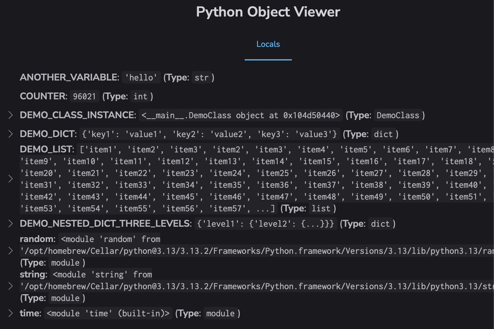

Debugging tool thats lets you easily inspect/visualize objects and variables in your running python code as a tree view.  

It uses the Debug Adapter Protocol (DAP) to retrieve the objects in your running python program. It then displays them in a web app.  

Every time you refresh the page, it briefly pauses your running code and displays a snapshot of its current state.  


#### Screenshot



## Setup
On the project you wish to debug, install [debugpy](https://github.com/microsoft/debugpy):  
`pipenv install debugpy`


### Start debugpy server
From the project you with to debug:
```
pipenv run python -m debugpy --listen localhost:5678 your-script.py
```

### Run python-objectviewer
In another terminal, clone this repo and run:
`HD_PORT=9000 pipenv run python pov.py`

Then open your browser at [http://localhost:9000](http://localhost:9000)

&nbsp; 

## Notes
By default this will grab the variables of the running program at the time you load/reload the python-objectviewer page. I like this for long-running programs / those that are running in an infinite loop; a quick refresh of this tool and it'll snapshot the current state without needing any modifications of the target program. 

If you want to capture the state more precisely you can do something like this in your target program:

```python
# At the start of your program
debugpy.wait_for_client()

# At the point in the code you want to capture
debugpy.breakpoint()
```

The code will then pause at the breakpoint until this tool connects and takes a snapshot of its current state. 